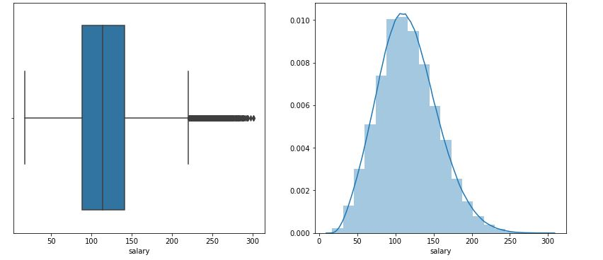

# Salary-Prediction-

### Define the Problem 

**Project Goal:** The goal of this project is to examine the dataset of job postings, and predict salaries for a new set of postings which involves building a model to predict the salaries given in the test dataset.

**Practical use:** HR Department who need real-time solutions in order to make effective employment offers to potential hires.

**Tool:** Python 3 (Jupyter Notebook) with a wide range of libraries/packages available for data manipulation and predictive modeling algorithms.

### Data 

train_features.csv: Each row represents metadata for an individual job posting. The job Id column represents a unique identifier for the job posting. The remaining columns describe features of the job posting. 

train_salaries.csv: Each row associates a job Id along with salary.

test_features.csv: Similar to train_features.csv, each row represents metadata for an individual job posting.

**Features**
* Job-Type - Janitor, Manager, CEO, CFO etc.
* Degree - High school, College, Master's etc.
* Major - Physics, Biology, Maths etc.
* Industry - Health, Finance, Oil etc.
* Years-of_Experience - Candidate experience in years
* Miles-From_Metropolis - Distance from the Metropolis

Every row has a unique JOB-ID, there is a column and COMPANY-ID which is the company identifier.

### Data Discovery Steps 

1. Import Libraries and set up directory where python interpreter access code files
2. Load Data
3. Examine and Get Insights on Data
4. The 3 input files each have 1 million rows.
    * Merged train data (train_features + train_target) which has 1 million rows and 9 columns
    * Test Feature data has 1 million rows and 8 columns
    * Datasets have mixed data types (categorical and numeric)
5. Clean data
    * No duplicates in data
    * Datasets do not have null values
    * Check for invalid data - Dropped 5 rows of data with invalid Salary  (salary less than or equal to 0) 
6. Explore data
7. Summarize Numerical and Categorical variables. Confirmed jobId is a unique identifier for the job postings
8. Review Correlation between each feature and the target variable using plots and feature counts as required
9. Identify correlation between all features respectively by using label encoding categorical features with the mean salary
10. Set baseline model
    * Using the correlation martix, identified the highest correlated feature and use this to build a simple linear regression model to predict the salary, using negative mean squared error as the quality of an estimator and values closer to zero are better
    * The baseline negative MSE error was -1288
11. Hypothesize solutions
    * Multiple Linear Regression - includes more than one feature, which could improve the model 
    * Random Forest Regressor - improves the accuracy by reducing overfitting problem and the variance in decision trees
    * GradientBoostingRegressor - data contains weakly correlated features, gradient boosting regression combines weak learners into a single strong learner, which could be an improvement to the baseline model
    
**Feature Summary**

- Job Type Feature

    
    
    * All job types roughly have a similar count in the data
    * From the boxplot, Janitors generally have lower salaries compared to the other job types and CEO/CTO have higher salaries compared to other job types
    * From this, there is a relationship between salaries and job types
    
- Degree Feature
    
     
     
     * Masters and High-school degree types tend to be more popular
     * From the boxplot, people with no degrees and in high school generally have lower salaries compared to the other degree type
     * From this, there is a relationship between salaries and degree types
   
- Major Feature 
    
     
     
     *'None' major tend to be most popular
     * From the boxplot, people who have 'none' major generally have lower salaries compared to the other majors
     * From this, there is a relationship between salaries and degree types
    
- Industry Feature
    
     
     
     * There are roughly equal counts of each industry within the data
     * From the boxplot, people with who work in the finance and oil industries generally have higher salaries compared to the other degree types
     * From this, there is a relationship between salaries and degree types
    
- Years of Experience Feature
    
     
     
     * From this, there is a positve linear relationship between salaries and number of years experience one has
     * Therefore the more experience you have, the higher the salary
    
- Miles From Metropolis Feature 
    
     
     
     * From this, there is a negative linear relationship between salaries and number of miles from Metropolis
     * Therefore the further you live from Metropolis, the lower the salary you would recieve
    
- Salary Target Variable 
    
     
     
     * From the boxplot and histogram we see that most values lie between 70k to 150k
     * The salary histogram plot has right skewness

**Correlation Matrix**

   * Positive correlation with years of experience. Years of experiencce has the strongest correlation with salary
   * Negative correlation with miles from Metropolis, major, degree and job type
   * Very little correlation with job id, company id and industry

    
### Model Development 
1. Feature Engineering
    * Transform categorical features into individual binary feature using the one hot encoding approach.
2. Create models
3. Evaluate Models 

|Model                      | Negative MSE
|---------------------------|:-----------:|
|Multiple Linear Regression |  -925       |
|Random Forest              | -389        |
|Gradient Boosting          | -358        |

4. Use the testing dataset to test the best model - the best model in this case is the gradient boosting algorithm 

### Deploy Solution 
1. Create a csv file with the predicitons on the testing dataset 
2. Identify the most influencial feature

* The most important feature to predict salary is **Job Type**
* The least import feature to predict salary is **Degree Type**

